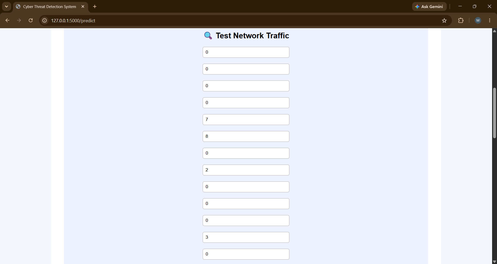
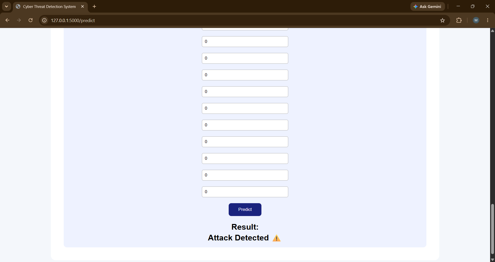

# Cyber Threat Detection System

## Project Overview
A Machine Learning based Cyber Threat Detection System that predicts whether network traffic is Normal or an Attack.

## Objective
To detect possible cyber threats by analyzing network traffic data using Machine Learning algorithms.

## Technologies Used
- Python
- Machine Learning
- Flask
- HTML/CSS
- Scikit-learn
- Pandas
- NumPy

## Dataset
Used network traffic dataset containing different features like protocol type, service, flag, duration, etc.

## Machine Learning Workflow
1. Data Collection
2. Data Preprocessing
3. Encoding Categorical Features
4. Model Training
5. Model Saving
6. Flask Web Application Integration
7. Attack Prediction

## Features
- Takes network traffic inputs
- Predicts Normal or Attack
- User-friendly web interface

## Model Used
Decision Tree Classifier

## Project Outcome
Successfully built a machine learning web application that can identify potential cyber threats from network traffic data.
## Project Screenshots

### Landing Page

### Testing Page

### Result Page

